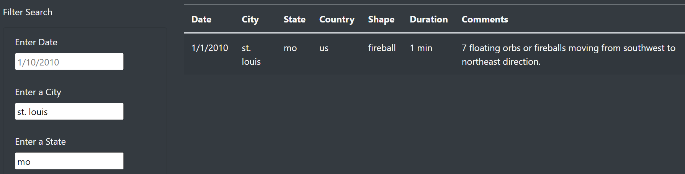
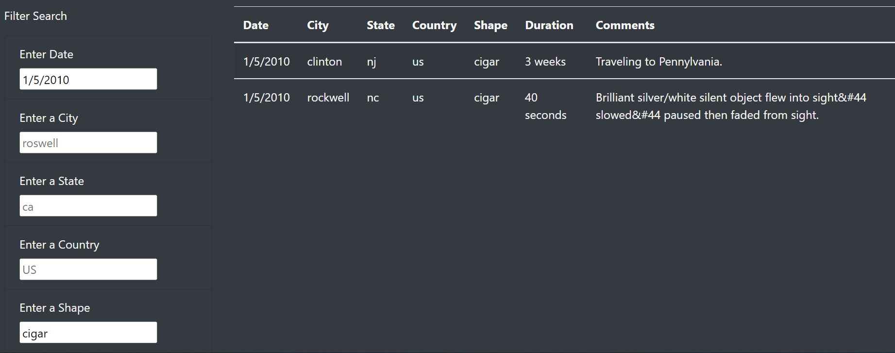

# UFO
## Overview of Project
We will be creating a webpage with a dynamic table. This table will utilized some given data which will react to user input. The user will can see more in-depth analysis of UFO sightings by the filters.
## Results:
At the bottom of the webpage, we have a collection of UFO sightings. The data is ordered by data but can be filtered to a specific date, city, state, country, or shape. For example: I want to look at a UFO siting in st. louis, Missouri. 
 
Or I want to look at a UFO siting on January 5, 2010 in the shape of a cigar. 
 

## Summary
